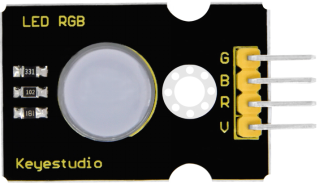
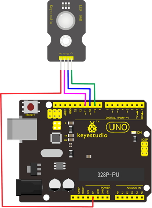
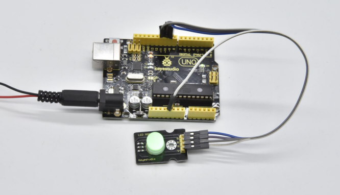
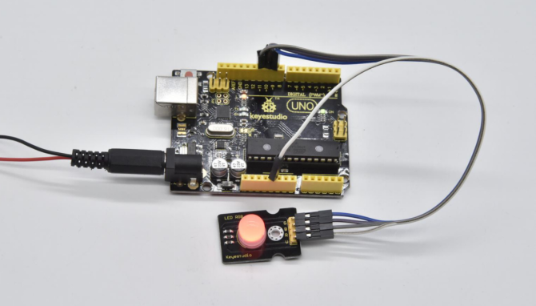

# KS0459 Keyestudio 10mm Highlight Full-color LED RGB Module


## 1. Overview

The keyestudio 10mm highlight full-color LED module is mainly compose of a Common Anode RGB LED.

When using, adjust the three primary colors (red/blue/green) strength through the PWM voltage input of R, G, B pin, so as to achieve the mixed full color effect.

The module comes with a 3mm fixing holes, easy to fix on any other devices.

## 2. Technical Details

- Working voltage: DC 5V
- Working current: 0.6A (MAX)
- Maximum power: 0.3W
- Operating temperature: -25～+65℃
- Interface: 4pin header (2.54mm pitch)
- Fixing hole diameter: 3mm
- Dimensions: 30mm*20mm
- Environmental attributes: ROHS



## 3. Connection



## 4. Test Code

Download code :  [Code](./Code.7z)

```c
int redPin= 11; // red led pin
int greenPin = 9; //green led pin
int bluePin = 10; //blue led pin

void setup() 
{
    pinMode(redPin, OUTPUT);
    pinMode(greenPin, OUTPUT);
    pinMode(bluePin, OUTPUT);
}

//loop, change a color per second
void loop() 
{
    setColor(0, 255, 255); // red
    delay(1000);
    setColor(255, 0, 255); //green
    delay(1000);
    setColor(255, 255, 0); //blue
    delay(1000);
    setColor(120,10,10); // set the light color to white by adjusting RGB value, 0,0,0  with color difference
    delay(1000);
}

//set the color
void setColor(int redValue, int greenValue, int blueValue) 
{
    analogWrite(redPin, redValue);
    analogWrite(greenPin, greenValue);
    analogWrite(bluePin, blueValue);
}
```

## 5. Test Result

Done uploading the code, RGB LED will turn on red, green , blue and white, with an interval of 1 second, alternately and circularly.



